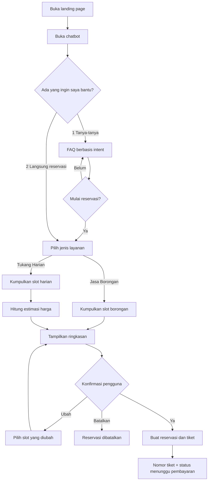

# MVP Plan

## 1. Ringkasan masalah

Calon pelanggan jasa tukang perlu memahami perbedaan Jasa Borongan dan Tukang
Harian, lalu mengisi data reservasi yang cukup panjang. Website biasa membuat
pengguna harus berpindah antara halaman informasi dan form. Chatbot ini
menyatukan proses tanya jawab dan reservasi dalam percakapan bertahap.

Target pengguna adalah individu yang membutuhkan:

- perbaikan bangunan secara borongan untuk rumah, apartemen, atau ruko; atau
- tukang harian berdasarkan spesialisasi untuk masalah hunian tertentu.

## 2. Tujuan MVP

MVP dinyatakan berhasil jika pengguna dapat:

1. Membuka landing page dan memulai chatbot.
2. Memilih jalur awal:
   `1. Tanya-tanya dulu layanan tukang` atau `2. Langsung reservasi`.
3. Mengajukan pertanyaan umum mengenai Jasa Borongan/Tukang Harian.
4. Beralih dari tanya jawab ke reservasi.
5. Menyelesaikan reservasi multi-turn pada salah satu jenis layanan.
6. Memeriksa ringkasan dan memberikan konfirmasi sebelum reservasi dibuat.
7. Menerima nomor tiket, status `MENUNGGU_PEMBAYARAN`, dan estimasi harga.
8. Melihat respons fallback saat intent tidak dikenali.
9. Menghasilkan log percakapan dalam format JSONL.

MVP juga harus menghasilkan artefak akademik untuk P1–P5: dataset minimal 200
utterance, pipeline preprocessing dan TF-IDF, model intent classification,
slot filling, evaluasi model, confusion matrix, serta analisis keterbatasan.

## 3. Scope fungsional

### 3.1 Jalur informasi

- Menjelaskan gambaran layanan.
- Menjelaskan cakupan dan data yang diperlukan untuk Jasa Borongan.
- Menjelaskan spesialisasi, sesi kerja, dan data Tukang Harian.
- Menjelaskan harga sebagai estimasi; nominal mengikuti konfigurasi MVP.
- Menawarkan transisi ke reservasi.
- Menjawab sapaan, penutup, dan input yang tidak dipahami.

### 3.2 Reservasi Jasa Borongan

Slot wajib:

| Slot | Aturan MVP |
|---|---|
| `customer_id` | Huruf/angka/`-`, 4–30 karakter |
| `phone_number` | Nomor Indonesia yang dapat dinormalisasi ke `+62` |
| `building_type` | `rumah`, `apartemen`, atau `ruko` |
| `survey_address` | Teks 10–300 karakter |
| `survey_date` | Tanggal yang tersedia dan tidak di masa lalu |
| `survey_time` | Salah satu slot waktu dari backend |
| `budget` | Rupiah, bilangan positif dalam batas konfigurasi |

Setelah seluruh slot valid, bot menampilkan ringkasan dan meminta konfirmasi
`ya/tidak`. Jawaban `ya` membuat reservasi dan tiket. Jawaban `tidak` memberi
pilihan slot yang ingin diubah atau membatalkan proses.

### 3.3 Reservasi Tukang Harian

Slot wajib:

| Slot | Aturan MVP |
|---|---|
| `customer_id` | Huruf/angka/`-`, 4–30 karakter |
| `phone_number` | Nomor Indonesia yang dapat dinormalisasi ke `+62` |
| `specialization` | Nilai dari katalog backend |
| `problem_description` | Teks 10–500 karakter |
| `worker_count` | Bilangan bulat sesuai batas konfigurasi |
| `start_date` | Tidak di masa lalu |
| `end_date` | Sama dengan/lebih besar dari tanggal mulai |
| `work_session` | `full_day`, `morning`, atau `afternoon` |
| `work_address` | Teks 10–300 karakter |
| `problem_photo` | Opsional; JPG/PNG/WebP sesuai batas ukuran |

Backend menghitung jumlah hari kerja dan estimasi harga berdasarkan
spesialisasi, jumlah tukang, jumlah hari, dan sesi. Setelah konfirmasi, backend
membuat tiket berstatus `MENUNGGU_PEMBAYARAN`.

### 3.4 Tiket

- Nomor tiket unik, contoh `TKT-20260728-AB12CD`.
- Menyimpan referensi reservasi, jenis layanan, estimasi harga, status, dan
  waktu pembuatan.
- Dapat diperiksa kembali dengan nomor tiket.
- Pengiriman email hanya disimulasikan sebagai pesan/flag
  `email_delivery: NOT_IMPLEMENTED`.

## 4. Di luar scope MVP

- Login, registrasi, dan verifikasi bahwa `customer_id` benar-benar dimiliki
  pengguna.
- Pembayaran dan integrasi payment gateway.
- Pengiriman email/WhatsApp nyata.
- Penjadwalan real-time dengan sistem tenaga kerja eksternal.
- Negosiasi atau harga final hasil survei Jasa Borongan.
- Computer vision untuk menganalisis foto.
- Dashboard admin, penugasan tukang, reschedule, refund, dan pembatalan setelah
  tiket dibuat.
- Generative AI/LLM dan speech-to-text.
- Dukungan bahasa selain Bahasa Indonesia.

## 5. Asumsi yang harus divalidasi

| ID | Asumsi MVP | Penanganan |
|---|---|---|
| A-01 | Katalog spesialisasi belum diberikan | Seed configurable, mis. listrik, plumbing, cat, kayu, atap, keramik |
| A-02 | Tarif belum diberikan | Gunakan tarif demo dalam config dan tampilkan label “estimasi” |
| A-03 | Slot survei belum diberikan | Generate slot demo dari hari/jam kerja yang dikonfigurasi |
| A-04 | Budget borongan tidak menentukan harga final | Disimpan sebagai preferensi; tiket tidak menyatakan harga final |
| A-05 | ID pelanggan tidak terhubung ke master customer | Validasi format saja |
| A-06 | Ketersediaan tukang tidak real-time | Reservasi berarti permintaan jadwal, bukan jaminan penugasan |
| A-07 | Lampiran foto opsional | Reservasi tetap bisa dilanjutkan tanpa foto |
| A-08 | Tarif harian mencakup hari kalender pada rentang tanggal | Aturan ini configurable sebelum implementasi pricing |

## 6. User journey utama

## 7. Non-functional requirements

- API memberikan response terstruktur dan error yang konsisten.
- Target respons lokal p95 di bawah 1 detik, di luar upload file.
- Data sensitif seperti nomor telepon tidak ditulis ke log aplikasi biasa;
  conversation log boleh menyimpan versi masked.
- Upload dibatasi tipe, ukuran, dan nama file yang dihasilkan server.
- Seluruh rule harga dan katalog berada di backend/configuration.
- Model dan vectorizer disimpan dengan versi yang sama.
- Training dapat direproduksi menggunakan seed tetap.
- Backend dan frontend memiliki unit test pada aturan bisnis kritis.
- Chat interface responsif dan dapat digunakan dengan keyboard.

## 8. Acceptance criteria end-to-end

- [ ] Prompt awal menampilkan dua pilihan yang diwajibkan.
- [ ] Minimal tiga pertanyaan FAQ yang berbeda mendapat jawaban sesuai intent.
- [ ] Reservasi Borongan dapat selesai sampai tiket.
- [ ] Reservasi Harian dapat selesai sampai tiket dan estimasi harga.
- [ ] Pengguna dapat memperbaiki minimal satu slot pada tahap konfirmasi.
- [ ] Input tidak valid tidak menghapus slot lain yang sudah terkumpul.
- [ ] Refresh/reconnect dapat melanjutkan conversation selama session ID valid.
- [ ] Setiap turn tersimpan sebagai satu event JSONL yang valid.
- [ ] Dataset berisi sekurangnya 200 utterance dan 4 intent; target MVP 240/8.
- [ ] Script evaluasi menghasilkan accuracy, macro/weighted
  precision-recall-F1, classification report, dan confusion matrix.
- [ ] Landing page dan chat dapat dijalankan melalui petunjuk README.

## 9. Definisi keberhasilan akademik

Tidak digunakan target accuracy arbitrer sebagai jaminan. Baseline yang
diinginkan adalah accuracy dan macro F1 minimal 0,80 pada stratified test set,
namun hasil aktual harus dilaporkan apa adanya. Jika hasil di bawah baseline,
analisis error dan rencana perbaikan tetap menjadi bagian wajib laporan.
