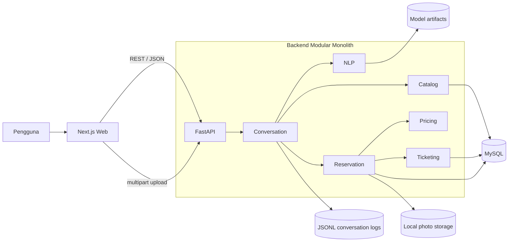

# Architecture Foundation

## 1. Gaya arsitektur

Repository menggunakan monorepo dengan dua deployable application:

- `backend`: modular monolith Python yang menyediakan HTTP API.
- `frontend`: Next.js web app yang mengonsumsi API backend.

Istilah modular monolith berlaku pada backend: satu process dan satu database,
namun domain dipisahkan menjadi module dengan public interface yang jelas.
Module tidak membaca table milik module lain secara sembarang; koordinasi
dilakukan melalui application service.



Urutan interaksi end-to-end, termasuk fallback NLP, kedua jenis reservasi,
upload, restore session, dan lookup tiket tersedia pada
[sequence diagram](diagram/sequence-diagram.md).

## 2. Tech stack

### Backend

| Area | Pilihan | Alasan |
|---|---|---|
| Runtime | Python 3.12 | Stabil dan memiliki ekosistem NLP kuat |
| API | FastAPI + Uvicorn | Typed API, validation, dan OpenAPI otomatis |
| Schema | Pydantic v2 | Validasi request/response dan configuration |
| NLP/data | scikit-learn, pandas, NumPy | TF-IDF, Logistic Regression, metrik, manipulasi dataset |
| Tokenization | Regex tokenizer sendiri | Transparan untuk laporan dan tanpa download corpus |
| Persistence | SQLAlchemy 2 + Alembic | ORM dan database migration |
| Database | MySQL 8 | Sesuai pengalaman developer dan cocok untuk data transaksi |
| Model artifact | joblib | Menyimpan pipeline sklearn yang telah dilatih |
| Conversation log | JSON Lines | Append-friendly dan memenuhi P5 |
| Testing | pytest, pytest-asyncio, HTTPX | Unit dan integration/API testing |
| Quality | Ruff + mypy | Lint/format dan static type checking |
| Dependency manager | `uv` | Lockfile cepat dan reproducible |

Model utama adalah `TfidfVectorizer` + `LogisticRegression`. Multinomial Naive
Bayes boleh ditambahkan sebagai baseline pembanding, tetapi bukan dependency
runtime utama.

### Frontend

| Area | Pilihan |
|---|---|
| Framework | Next.js 16, App Router, React |
| Language | TypeScript strict |
| Package manager | Bun |
| Styling | Tailwind CSS |
| Components | shadcn/ui + Radix primitives |
| Forms | React Hook Form + Zod bila form non-chat diperlukan |
| Server state | Native `fetch`; TanStack Query hanya jika kebutuhan cache meningkat |
| Quality | ESLint, Prettier, Husky, lint-staged |
| Testing | Vitest + Testing Library; Playwright untuk happy path |

Chat state utama tetap berasal dari backend. Frontend hanya menyimpan
`conversation_id`, menampilkan message, mengirim input/quick reply, dan
menangani upload.

## 3. Proposed repository structure

```text
reservation-chatbot/
├── apps/
│   ├── backend/
│   │   ├── app/
│   │   │   ├── main.py
│   │   │   ├── shared/
│   │   │   │   ├── config.py
│   │   │   │   ├── database.py
│   │   │   │   ├── errors.py
│   │   │   │   └── observability.py
│   │   │   └── modules/
│   │   │       ├── catalog/
│   │   │       ├── conversation/
│   │   │       ├── nlp/
│   │   │       ├── reservation/
│   │   │       ├── pricing/
│   │   │       └── ticketing/
│   │   ├── migrations/
│   │   ├── scripts/
│   │   │   ├── generate_intents_dataset.py
│   │   │   ├── review_intents_dataset.py
│   │   │   ├── analyze_intents_dataset.py
│   │   │   ├── export_preprocessing_examples.py
│   │   │   ├── train_model.py
│   │   │   └── evaluate_model.py
│   │   ├── tests/
│   │   ├── pyproject.toml
│   │   └── uv.lock
│   └── frontend/
│       ├── src/
│       │   ├── app/
│       │   ├── components/
│       │   │   ├── landing/
│       │   │   ├── chat/
│       │   │   └── ui/
│       │   ├── features/chat/
│       │   ├── lib/
│       │   └── types/
│       ├── public/
│       ├── package.json
│       └── bun.lock
├── data/
│   ├── raw/intents.csv
│   ├── processed/
│   ├── reviews/
│   ├── logs/.gitkeep
│   └── README.md
├── artifacts/
│   ├── models/.gitkeep
│   └── evaluation/
│       ├── dataset-analysis.json
│       ├── dataset-distribution.csv
│       ├── preprocessing-examples.csv
│       ├── text-length-summary.csv
│       └── text-lengths.csv
├── storage/uploads/.gitkeep
├── docs/
├── compose.yaml
├── .env.example
└── README.md
```

Generated dataset boleh di-commit untuk kebutuhan penilaian. Conversation log,
upload pengguna, database volume, dan model binary sebaiknya di-`.gitignore`.
Hasil evaluasi seperti CSV metrik dan PNG confusion matrix boleh di-commit
sebagai bukti UAS setelah model dilatih.

## 4. Backend modules

| Module | Tanggung jawab | Tidak bertanggung jawab |
|---|---|---|
| `nlp` | Preprocessing, load pipeline, predict intent/confidence | Menentukan langkah reservasi |
| `conversation` | State machine, next prompt, fallback, context/session, log turn | Menyimpan transaksi final langsung |
| `catalog` | Jenis layanan, spesialisasi, sesi, available survey slots | Kalkulasi total |
| `reservation` | Validasi slot lintas field, draft dan final reservation | Klasifikasi intent |
| `pricing` | Fixed rate versioned, kalkulasi Harian/Borongan, dan breakdown | Membuat tiket |
| `ticketing` | Nomor tiket, status lifecycle, lookup | Mengirim email nyata |
| `shared` | Config, DB session, error model, clock/ID abstraction | Business rule spesifik |

Dependency direction:

```text
api -> application service -> domain rules -> repository interface
                                      infrastructure implements repository
conversation -> nlp/catalog/reservation application interfaces
reservation -> pricing and ticketing application interfaces
```

Tidak perlu message broker, service discovery, atau network call antar-module
untuk MVP.

## 5. API contract awal

Base path: `/api/v1`.

Definisi endpoint, parameter, request/response schema, status code, enum, dan
error response yang normatif berada pada
[OpenAPI contract](api-contract/openapi.yml). Tabel berikut adalah ringkasan
untuk membantu pembacaan arsitektur.

### Endpoints

| Method | Path | Fungsi |
|---|---|---|
| `GET` | `/health` | Liveness sederhana |
| `GET` | `/ready` | Cek DB dan model sudah dimuat |
| `POST` | `/conversations` | Membuat session dan memperoleh prompt awal |
| `POST` | `/conversations/{conversation_id}/messages` | Mengirim teks/quick reply dan mendapat respons berikutnya |
| `GET` | `/conversations/{conversation_id}` | Memulihkan message dan state session |
| `POST` | `/conversations/{conversation_id}/attachments` | Upload foto masalah untuk draft aktif |
| `GET` | `/catalog/services` | Katalog layanan dan spesialisasi |
| `GET` | `/catalog/survey-slots` | Pilihan tanggal/jam survei |
| `GET` | `/tickets/{ticket_number}` | Melihat ringkasan dan status tiket |
| `GET` | `/nlp/model-info` | Metadata model/dataset untuk demo UAS |

Response berhasil menggunakan root `status` dan object `data`; response chat
menempatkan snapshot pada `data` melalui `ConversationResponse`. Kegagalan
level HTTP hanya memiliki `status` melalui `ErrorResponse`. Adaptasi ini tidak
memakai `traceId` atau metadata pagination karena belum dibutuhkan. Frontend
tidak menentukan `state` berikutnya dan tidak mengirim total harga. Contoh
lengkap tersedia pada kontrak OpenAPI agar tidak diduplikasi.

## 6. Data model

### Relational entities

ERD telah dipindahkan ke [Entity Relationship Diagram](diagram/erd.md) sebagai
sumber tunggal untuk entity, kardinalitas, data dictionary, constraint, index,
serta boundary antara MySQL, JSONL, model artifact, dan file storage.

Untuk menjaga scope, detail unik Borongan/Harian disimpan pada JSON tervalidasi
Pydantic. Jika sistem berkembang, detail dapat dinormalisasi menjadi table
terpisah.

### Pricing boundary

Backend `pricing` menggunakan fixed rate `pricing-v1`: matriks
specialization/session untuk Harian dan harga dasar building type untuk
Borongan, dengan biaya admin serta survei yang tetap. Nilai dan rumus lengkap
berada pada [MVP plan](01-mvp-plan.md#34-harga-demo-tetap). Frontend hanya
merender breakdown dari API.

### Ticket status MVP

```text
MENUNGGU_KONFIRMASI --(pengguna setuju)--> MENUNGGU_PEMBAYARAN
```

Status pembayaran selanjutnya hanya placeholder dan tidak berubah otomatis
karena payment gateway berada di luar scope.

Nomor tiket canonical mengikuti regex `^TKT-[0-9]{8}-[A-Z0-9]{6}$`, misalnya
`TKT-20260728-AB12CD`.

## 7. Conversation persistence dan logging

State/session disimpan di MySQL agar dapat dipulihkan. Selain itu, setiap turn
di-append ke `data/logs/conversations-YYYY-MM-DD.jsonl`.

Contoh satu event log:

```json
{
  "event_id": "01J...",
  "timestamp": "2026-07-28T10:15:00+07:00",
  "conversation_id": "01J...",
  "turn": 4,
  "sender": "user",
  "raw_text": "nomor WA saya 0812****7890",
  "normalized_text": "nomor wa saya 0812 masked 7890",
  "predicted_intent": null,
  "confidence": null,
  "state_before": "BORONGAN_ASK_PHONE",
  "state_after": "BORONGAN_ASK_BUILDING",
  "extracted_slots": {"phone_number": "+62812****7890"},
  "response_text": "Jenis bangunannya rumah, apartemen, atau ruko?",
  "model_version": "intent-v1"
}
```

Log dataset/training dan log percakapan runtime adalah dua hal berbeda.
Runtime log tidak otomatis dimasukkan kembali ke training set karena mungkin
mengandung data pribadi dan label yang belum diverifikasi.

## 8. Security dan privacy baseline

- Masking nomor telepon pada JSONL dan application log.
- Nomor lengkap hanya disimpan pada database; encryption at rest menjadi
  target foundation, minimal jangan pernah masuk source control.
- Validasi MIME, extension, magic bytes, ukuran, serta generated filename untuk
  upload. File tidak dieksekusi dan tidak disajikan dari path mentah.
- CORS hanya mengizinkan origin frontend yang dikonfigurasi.
- Rate limit ringan per IP/session untuk endpoint message dan upload.
- Tidak me-render text bot/user sebagai raw HTML.
- Secret dan DSN hanya melalui environment variable.
- Retention log/upload didokumentasikan; untuk demo lokal dapat dibersihkan
  manual setelah penilaian.

## 9. Deployment dan local development

`compose.yaml` menjalankan MySQL dan, bila diinginkan, backend/frontend.
Development normal dapat tetap menjalankan:

```text
bun run --cwd apps/frontend dev
uv run --project apps/backend uvicorn app.main:app --reload
docker compose up mysql
```

Environment minimal:

```text
DATABASE_URL
FRONTEND_ORIGIN
MODEL_PATH
CONVERSATION_LOG_DIR
UPLOAD_DIR
MAX_UPLOAD_MB
APP_TIMEZONE=Asia/Jakarta
```

CI foundation menjalankan backend lint/typecheck/test, frontend
lint/typecheck/test, dan build frontend. Training model tidak dijalankan pada
setiap commit; artifact dibuat melalui task eksplisit dan diverifikasi metadata
versinya.

## 10. Architecture decision records yang disarankan

- ADR-001: Modular monolith dalam monorepo.
- ADR-002: TF-IDF + Logistic Regression untuk intent classifier.
- ADR-003: Deterministic state machine untuk transaksi reservasi.
- ADR-004: MySQL untuk transaksi dan JSONL untuk evidence log.
- ADR-005: Fixed demo pricing yang versioned dan availability sebagai
  configuration MVP.
