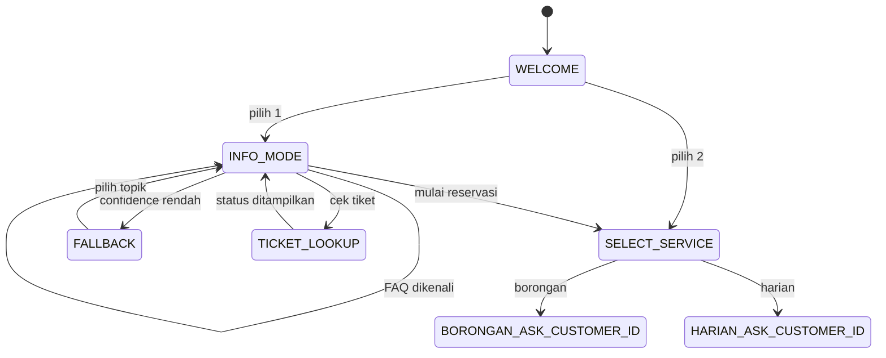
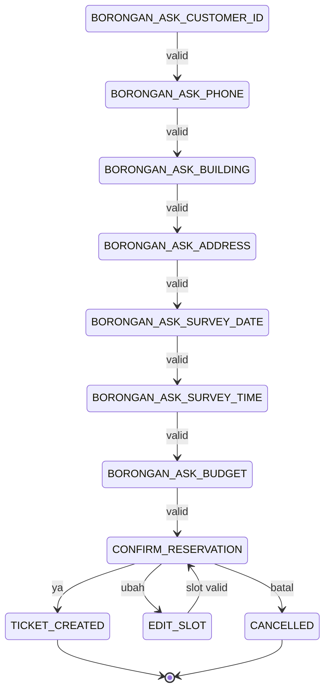
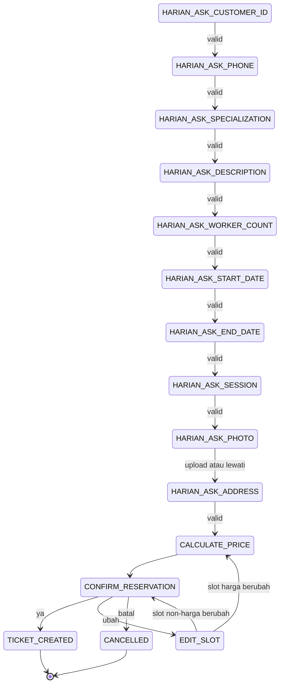

# NLP and Dialog Design

## 1. Pendekatan sistem

Sistem bersifat hybrid:

1. Intent classifier memahami tujuan utterance saat pengguna berada di menu
   umum/FAQ.
2. Rule-based slot filling membaca nilai terstruktur saat dialog sedang
   mengumpulkan data reservasi.
3. Dialog manager berbasis finite state machine menentukan pertanyaan
   berikutnya, validasi, koreksi, konfirmasi, dan pembuatan tiket.

Intent classifier tidak boleh bebas melompati state transaksi. Contohnya,
saat state meminta nomor telepon, prioritas sistem adalah phone extractor,
bukan menafsirkan nomor tersebut sebagai intent FAQ.

## 1.1 Standar bahasa respons chatbot

Semua teks yang ditampilkan kepada pengguna harus memakai Bahasa Indonesia yang
ramah, sopan, jelas, dan solutif seperti customer service. Standar ini berlaku
untuk prompt pembuka, jawaban FAQ, pertanyaan slot, validasi, fallback,
ringkasan, konfirmasi, pembatalan, error, serta respons tiket.

Pedoman tone of voice:

- Gunakan sapaan dan kata bantu yang santun, misalnya “Halo”, “mohon”,
  “silakan”, dan “terima kasih”.
- Gunakan kata ganti `Anda` secara konsisten. `Kak` boleh dipakai pada sapaan
  ringan, tetapi jangan mencampur beberapa panggilan dalam satu percakapan.
- Sampaikan informasi secara ringkas dan langsung; prioritaskan langkah
  berikutnya yang dapat dilakukan pengguna.
- Akui input pengguna sebelum meminta data berikutnya bila konteksnya perlu,
  misalnya “Baik, tanggal surveinya sudah kami catat.”
- Jangan menyalahkan pengguna. Hindari kata-kata seperti “salah”, “Anda gagal”,
  “tidak jelas”, sindiran, huruf kapital berlebihan, dan tanda seru beruntun.
- Jangan menjanjikan hasil yang belum pasti. Reservasi adalah permintaan jadwal,
  bukan jaminan tukang tersedia atau pekerjaan langsung dimulai.
- Jangan mengulang data sensitif secara penuh. Nomor telepon dan customer ID
  yang perlu ditampilkan kembali harus dimasking.
- Emoji tidak wajib; jika digunakan, maksimal satu emoji yang relevan dan
  tidak dipakai pada error, penolakan, atau informasi sensitif.

Pola respons yang diwajibkan:

| Situasi | Struktur respons |
|---|---|
| Prompt slot | Konteks singkat → data yang diminta → contoh/opsi jika perlu |
| Input invalid | Permintaan maaf/penanda lembut → alasan spesifik → format benar → minta ulang |
| Fallback NLP | Nyatakan belum yakin → tawarkan topik yang didukung → tampilkan quick replies |
| Aksi berhasil | Konfirmasi singkat → ringkasan relevan → langkah berikutnya |
| Pembatalan | Konfirmasi tanpa menghakimi → jelaskan data/tiket tidak dibuat → tawarkan menu |
| Error sistem | Minta maaf → jelaskan kendala tanpa detail teknis → sarankan retry yang aman |

Contoh copy:

| Hindari | Gunakan |
|---|---|
| “Nomor salah.” | “Maaf, nomor teleponnya belum sesuai. Mohon masukkan nomor Indonesia, misalnya 081234567890.” |
| “Input tidak jelas.” | “Maaf, saya belum yakin memahami pertanyaan Anda. Silakan pilih topik Borongan, Tukang Harian, harga, atau reservasi.” |
| “Tanggal tidak valid.” | “Tanggal tersebut belum dapat digunakan. Silakan pilih tanggal hari ini atau setelahnya, misalnya 2 Agustus 2026.” |
| “Tiket tidak ditemukan.” | “Maaf, tiket tersebut belum ditemukan. Mohon periksa kembali formatnya, misalnya TKT-20260728-AB12CD.” |
| “Batal.” | “Baik, proses reservasi dibatalkan dan tidak ada tiket yang dibuat. Ada hal lain yang dapat saya bantu?” |

Business rule dan kejujuran informasi tetap lebih penting daripada keramahan.
Bahasa yang hangat tidak boleh menutupi kegagalan, mengubah status, atau
menjanjikan layanan yang belum tersedia.

## 2. Dataset intent

Target dataset awal adalah 240 utterance buatan sendiri dalam Bahasa Indonesia.
Semua utterance akan direview agar tidak hanya berupa perubahan satu kata dari
template yang sama.

| Intent | Jumlah | Persentase | Contoh tujuan |
|---|---:|---:|---|
| `greeting` | 25 | 10,42% | Sapaan/memulai percakapan |
| `service_overview` | 30 | 12,50% | Menanyakan layanan yang tersedia |
| `borongan_info` | 35 | 14,58% | Cakupan/survei Jasa Borongan |
| `harian_info` | 35 | 14,58% | Cakupan/spesialisasi Tukang Harian |
| `pricing_info` | 30 | 12,50% | Menanyakan tarif/estimasi/budget |
| `start_reservation` | 35 | 14,58% | Meminta mulai booking/reservasi |
| `reservation_status` | 25 | 10,42% | Mengecek tiket/status reservasi |
| `goodbye` | 25 | 10,42% | Mengakhiri percakapan |
| **Total** | **240** | **100%** | |

Distribusi dibuat cukup seimbang untuk proyek akademik. Intent informasi dan
reservasi diberi sedikit lebih banyak variasi karena bahasa pengguna di area
tersebut lebih beragam dan batas antarkelasnya lebih mudah tumpang tindih.

### Format raw dataset

`data/raw/intents.csv`:

```csv
id,text,intent,source
utt-0001,Halo,greeting,synthetic_manual
utt-0058,Pekerjaan apa saja yang masuk layanan borongan?,borongan_info,synthetic_manual
utt-0129,Berapa tarif tukang harian per hari?,pricing_info,synthetic_manual
utt-0177,Boking tukang buat besok dong,start_reservation,synthetic_manual
```

Dataset generator harus deterministic, namun hasilnya tetap direview manual.
Kolom `source` membuat asal data transparan. ID unik dipakai untuk traceability.

### Pedoman variasi utterance

- Formal dan percakapan: “Saya ingin…” / “mau… dong”.
- Sinonim relevan: pesan, booking, reservasi; biaya, tarif, harga.
- Bentuk pertanyaan dan pernyataan.
- Typo ringan yang realistis dalam porsi kecil.
- Konteks eksplisit Borongan/Harian maupun konteks singkat.
- Tidak memasukkan nomor telepon/alamat nyata.
- Hindari duplikat exact maupun near-duplicate lintas train dan test.
- Label berdasarkan tujuan utama, bukan semata keyword.

### Quality checks

- Total dan jumlah per intent sesuai tabel.
- Tidak ada `text` kosong, ID duplikat, atau label di luar taxonomy.
- Exact duplicate dihapus sebelum split.
- Near-duplicate diperiksa sebelum split untuk mengurangi data leakage.
- Panjang karakter/token dan contoh per label dilaporkan.
- Minimal dua orang melakukan spot-check bila memungkinkan; jika hanya satu,
  keterbatasan tersebut ditulis dalam laporan.

## 3. Text preprocessing

Urutan pipeline:

1. Unicode normalization (`NFKC`).
2. Lowercase.
3. Ganti URL, email, dan nomor telepon dengan token khusus bila muncul.
4. Hapus HTML dan karakter kontrol.
5. Normalisasi whitespace.
6. Pertahankan kata/angka yang informatif; ubah tanda baca lain menjadi spasi.
7. Tokenisasi dengan regex.

Token khusus canonical adalah `urltoken`, `emailtoken`, dan `phonetoken`.
Implementasi reusable berada di `app/modules/nlp/preprocessing.py`. Fungsi
`clean_text` dan `tokenize_cleaned_text` wajib direferensikan oleh training dan
inference agar transformasi input tidak berbeda.

Stemming dan stopword removal tidak digunakan pada baseline. Untuk utterance
pendek, stopword seperti “mau”, “apa”, dan “berapa” dapat membantu membedakan
intent. Stemming Bahasa Indonesia dapat diuji sebagai eksperimen terpisah,
tetapi hasilnya harus dibandingkan dengan baseline.

Contoh berikut dihasilkan oleh script
`apps/backend/scripts/export_preprocessing_examples.py`, bukan diketik manual
ke artifact:

| Sebelum | Setelah cleaning/lowercase | Token |
|---|---|---|
| `Halo Kak!! Ada jasa tukang listrik?` | `halo kak ada jasa tukang listrik` | `["halo","kak","ada","jasa","tukang","listrik"]` |
| `Saya mau BOOKING tukang utk 02/08/2026.` | `saya mau booking tukang utk 02 08 2026` | `["saya","mau","booking","tukang","utk","02","08","2026"]` |
| `Cek tiket TKT-20260728-AB12CD dong` | `cek tiket tkt 20260728 ab12cd dong` | `["cek","tiket","tkt","20260728","ab12cd","dong"]` |

Preprocessor yang sama harus dipakai saat training dan inference. Cara paling
aman adalah membungkusnya di sklearn `Pipeline`.

Hasil NLP-04–NLP-06 tersimpan di `artifacts/evaluation/`:

- `dataset-distribution.csv` untuk jumlah dan persentase tiap intent.
- `text-lengths.csv` untuk panjang karakter/token setiap utterance.
- `text-length-summary.csv` dan `dataset-analysis.json` untuk statistik
  keseluruhan serta per intent.
- `preprocessing-examples.csv` untuk contoh sebelum, sesudah cleaning, dan
  token.

Pada dataset saat ini, panjang keseluruhan berada pada rentang 4–58 karakter
dan 1–8 token, dengan rata-rata 33,94 karakter dan 5,13 token. Angka laporan
harus tetap diambil dari artifact karena dapat berubah ketika dataset
diregenerasi.

## 4. Representasi dan intent classification

Baseline utama:

```text
cleaner/tokenizer
  -> TfidfVectorizer(ngram_range=(1, 2), sublinear_tf=True)
  -> LogisticRegression(class_weight="balanced", max_iter=1000, random_state=42)
```

Hyperparameter dipilih melalui cross-validation hanya pada training data.
Candidate grid kecil:

- `ngram_range`: `(1, 1)` atau `(1, 2)`.
- `min_df`: `1` atau `2`.
- Logistic Regression `C`: `0.5`, `1.0`, `2.0`.

Multinomial Naive Bayes dapat dilaporkan sebagai baseline pembanding. Model
final dipilih berdasarkan macro F1 validation/cross-validation, bukan test set.

### Split dan reproducibility

- Stratified split: 80% train (192), 20% test (48).
- `random_state=42`.
- Bila melakukan tuning: stratified 5-fold CV hanya pada 192 train samples.
- Test set disentuh satu kali untuk evaluasi final.
- Simpan pipeline, label list, dataset checksum, waktu training, library
  versions, dan model version.

### Confidence dan fallback

`predict_proba` dipakai untuk confidence. Threshold tidak ditentukan dengan
menebak test result; threshold awal dipilih dari validation behavior. Jika
confidence di bawah threshold, bot memberi respons:

> Maaf, saya belum yakin memahami pertanyaan Anda. Anda ingin mengetahui Jasa
> Borongan, Tukang Harian, harga, atau mulai reservasi?

Quick reply menjaga pengguna tetap dapat melanjutkan meskipun classifier gagal.

## 5. Rule-based slot filling

Extractor membaca raw text dan state aktif. Contoh:

| Slot | Teknik | Contoh |
|---|---|---|
| `phone_number` | Regex + normalisasi `0`, `62`, `+62` | `0812 3456 7890` → `+6281234567890` |
| `customer_id` | Regex exact `^[0-9]{10}$`; simpan sebagai string | `0123456789` |
| `building_type` | Dictionary/synonym matching | `rumah saya` → `rumah` |
| `budget` | Regex nominal + unit | `sekitar 20 juta` → `20000000` |
| `specialization` | Dictionary/katalog allow-list | `spesialis AC` → `ac` |
| `worker_count` | Regex angka/kata bilangan terbatas | `dua orang` → `2` |
| `work_session` | Pattern/synonym | `setengah hari pagi` → `morning` |
| dates | Parser format Indonesia + validation | `2 Agustus 2026` → ISO date |
| ticket number | Regex `^TKT-[0-9]{8}-[A-Z0-9]{6}$`; input dinormalisasi uppercase | `TKT-20260728-AB12CD` |

Alamat dan deskripsi bukan NER; keduanya diambil sebagai jawaban penuh pada
state yang sesuai lalu divalidasi panjangnya. Foto masuk melalui endpoint
attachment dan menghasilkan `attachment_id`.

Nilai canonical yang valid untuk slot `specialization` adalah `cat`, `genteng`,
`ac`, `listrik`, `keramik`, dan `pipa`. UI menampilkannya sebagai Spesialis
Cat, Spesialis Genteng, Spesialis AC, Spesialis Listrik, Spesialis Keramik, dan
Spesialis Pipa.

Jika satu utterance mengandung beberapa slot—misalnya “dua tukang dari tanggal
2 sampai 3 Agustus”—semua slot valid boleh disimpan sekaligus. Dialog manager
lalu menanyakan slot wajib berikutnya yang masih kosong.

## 6. Dialog state machine

### State umum



### Jasa Borongan



### Tukang Harian



Pada setiap `ASK_*`, jawaban invalid mempertahankan state, menjelaskan format
yang diharapkan, dan memberi contoh. Perintah global `batal`, `mulai ulang`,
`menu`, dan `bantuan` ditangani sebelum extractor state.

## 7. Pricing design

Pricing memakai konfigurasi immutable bernama `pricing-v1`. Seluruh nominal
dinyatakan dalam rupiah dan ditentukan backend:

```text
daily_rate = {
  cat:      {full_day: 250000, morning: 150000, afternoon: 150000},
  genteng:  {full_day: 350000, morning: 210000, afternoon: 210000},
  ac:       {full_day: 300000, morning: 180000, afternoon: 180000},
  listrik:  {full_day: 325000, morning: 195000, afternoon: 195000},
  keramik:  {full_day: 300000, morning: 180000, afternoon: 180000},
  pipa:     {full_day: 325000, morning: 195000, afternoon: 195000}
}

borongan_base = {
  rumah: 5000000,
  apartemen: 4000000,
  ruko: 7500000
}

admin_fee = 25000
borongan_survey_fee = 100000
```

Rumus estimasi Tukang Harian:

```text
jumlah_hari = inclusive_day_count(start_date, end_date)
unit_rate = daily_rate[specialization][work_session]
subtotal = unit_rate * worker_count * jumlah_hari
estimated_price = subtotal + admin_fee
```

Rumus estimasi Jasa Borongan:

```text
subtotal = borongan_base[building_type]
estimated_price = subtotal + borongan_survey_fee + admin_fee
```

Breakdown selalu menyertakan `pricing_version`, unit/base price, subtotal,
biaya admin, biaya survei bila berlaku, dan total. `budget` Borongan adalah
preferensi pengguna yang ditampilkan terpisah dan tidak memengaruhi total.
Nilai ini sengaja fixed untuk menjaga fokus project pada pengembangan chatbot,
bukan sistem pricing komersial.

## 8. Evaluation plan

Script evaluasi wajib menghasilkan:

- Accuracy.
- Precision, recall, dan F1 per class.
- Macro average dan weighted average.
- Confusion matrix dalam CSV dan PNG.
- Daftar contoh misclassification berisi text, actual, predicted, confidence.
- Distribusi train/test per intent.

Output direncanakan:

```text
artifacts/evaluation/
├── metrics.json
├── classification-report.csv
├── confusion-matrix.csv
├── confusion-matrix.png
├── misclassified.csv
├── dataset-distribution.csv
└── preprocessing-examples.csv
```

### Analisis error yang wajib ditulis setelah eksperimen

Jangan menyatakan intent paling sering salah sebelum hasil model tersedia.
Analisis final mengambil pasangan off-diagonal terbesar pada confusion matrix,
lalu memeriksa contoh utterance-nya.

Hipotesis awal yang perlu diuji:

- `borongan_info` vs `pricing_info`, karena pertanyaan budget borongan memuat
  kata biaya/harga.
- `harian_info` vs `pricing_info`, karena “tarif tukang harian” menyebut nama
  layanan sekaligus harga.
- `service_overview` vs kedua intent layanan, terutama pada pertanyaan pendek.
- `start_reservation` vs `harian_info`, misalnya “butuh tukang listrik”.

Penyebab yang mungkin:

- Dataset sintetis kecil tidak mencerminkan variasi pengguna nyata.
- Keyword yang sama muncul di beberapa intent.
- Utterance pendek tidak memiliki konteks.
- Typo/slang belum terwakili.
- Label tujuan utama bersifat ambigu.
- Split mengandung distribusi variasi bahasa yang tidak merata.

### Keterbatasan sistem

- Hanya Bahasa Indonesia dan domain jasa tukang terbatas.
- Intent taxonomy kecil; pertanyaan di luar scope menghasilkan fallback.
- TF-IDF tidak memahami makna/konteks sedalam embedding atau LLM.
- Rule-based slot filling sensitif terhadap format baru.
- State disimpan per conversation, sehingga penggunaan ID yang salah dapat
  mengganggu konteks.
- Data sintetis berpotensi membuat metrik lebih optimistis dari pemakaian nyata.
- Tidak ada availability, payment, customer, email, atau WhatsApp real-time.
- Estimasi memakai harga demo fixed `pricing-v1`, bukan harga pasar atau
  kebijakan komersial nyata.
- Foto hanya disimpan, tidak dianalisis.

## 9. Conversation test scenarios

Minimal automated scenarios:

1. Welcome → info → tanya Borongan → mulai reservasi.
2. Direct reservation → Borongan → semua slot valid → confirm → ticket.
3. Direct reservation → Harian → skip photo → price → confirm → ticket.
4. Phone invalid lalu valid, state tidak meloncat.
5. End date sebelum start date, bot meminta ulang.
6. Konfirmasi `ubah` → ubah jumlah tukang → harga dihitung ulang.
7. Konfirmasi `batal` tidak membuat reservation/ticket.
8. Low-confidence message menghasilkan fallback dan quick replies.
9. Ticket lookup valid dan nomor tiket tidak ditemukan.
10. Refresh session mengembalikan state dan slots yang sama.
