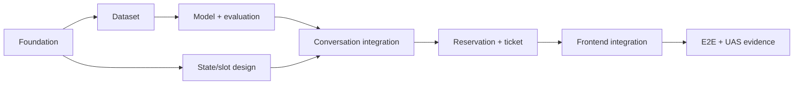

# Task Breakdown

## 1. Strategi delivery

Pengerjaan dibagi per vertical milestone. Urutan ini menjaga agar dataset dan
model tersedia sebelum dialog manager diintegrasikan, lalu backend dapat diuji
sebelum UI chat dibangun.

Estimasi menggunakan ideal developer-days untuk satu developer dan hanya
berfungsi sebagai alat perencanaan, bukan deadline.

## 2. Milestones

| Milestone | Outcome | Estimasi |
|---|---|---:|
| M0 Foundation | Monorepo, tooling, database, quality gates | 1–2 hari |
| M1 NLP baseline | Dataset 240 data, model, metrics, confusion matrix | 2–3 hari |
| M2 Conversation core | FAQ, state machine, slot filling, logging | 3–4 hari |
| M3 Reservation/ticket | Dua flow transaksi, pricing, confirmation, ticket | 3–4 hari |
| M4 Frontend MVP | Landing page dan chat end-to-end | 3–4 hari |
| M5 Verification/report | Tests, evidence P1–P5, README demo | 2–3 hari |

Total kasar: 14–20 ideal developer-days. Scope dapat diselesaikan lebih cepat
jika styling dan test matrix dibuat minimal, tetapi evidence akademik tidak
boleh dikurangi.

## 3. Detailed backlog

### M0 — Project foundation

- [x] `FND-01` Buat struktur `apps/backend`, `apps/frontend`, `data`,
  `artifacts`, `storage`, dan `docs`.
- [x] `FND-02` Bootstrap FastAPI Python 3.12 dengan `uv`.
- [x] `FND-03` Konfigurasi Ruff, mypy, pytest, environment settings, dan
  structured error.
- [x] `FND-04` Bootstrap Next.js 16 App Router menggunakan Bun dan TypeScript
  strict.
- [x] `FND-05` Tambahkan Tailwind CSS serta inisialisasi shadcn/ui.
- [x] `FND-06` Konfigurasi ESLint, Prettier, Husky, dan lint-staged.
- [x] `FND-07` Tambahkan MySQL `compose.yaml`, SQLAlchemy, dan Alembic.
- [x] `FND-08` Buat `.env.example`, `.gitignore`, health/ready endpoint.
- [x] `FND-09` Tambahkan root developer commands dan CI quality checks.

Definition of Done:

- Backend dan frontend dapat dijalankan lokal.
- Health check berhasil, database migration dapat dijalankan.
- Lint, typecheck, unit test kosong/baseline, dan frontend build berhasil.

### M1 — Dataset dan NLP baseline

- [x] `NLP-01` Finalisasi taxonomy 8 intent dan labeling guideline.
- [x] `NLP-02` Implement deterministic dataset generator 240 utterance.
- [x] `NLP-03` Review manual untuk duplicate, near-duplicate, variasi, dan
  konsistensi label.
- [x] `NLP-04` Implement analyzer distribusi intent/panjang teks.
- [x] `NLP-05` Implement preprocessing reusable beserta unit test.
- [x] `NLP-06` Export contoh sebelum/sesudah preprocessing.
- [x] `NLP-07` Train TF-IDF + Logistic Regression pipeline dengan stratified
  split dan seed tetap.
- [ ] `NLP-08` Opsional: train MultinomialNB sebagai baseline pembanding.
- [x] `NLP-09` Generate accuracy, classification report, confusion matrix, dan
  daftar misclassification.
- [x] `NLP-10` Simpan artifact beserta checksum dataset dan metadata versi.
- [x] `NLP-11` Buat model loader dan unit test inference/fallback threshold.

Definition of Done:

- Raw CSV memiliki tepat 240 row valid dan distribusi terdokumentasi.
- Training reproducible dari command tunggal.
- Semua metrik P4 dan contoh preprocessing P2 dihasilkan sebagai artifact.
- Laporan belum mengklaim penyebab error tanpa merujuk hasil aktual.

### M2 — Conversation core

- [x] `CONV-01` Definisikan enum state, conversation context, dan response DTO.
- [x] `CONV-02` Implement session create/get dan prompt pembuka dua pilihan
  dengan copy ramah sesuai standar customer service.
- [x] `CONV-03` Implement FAQ router berbasis model intent dan confidence,
  termasuk fallback yang sopan dan terarah.
- [x] `CONV-04` Implement global commands: batal, menu, bantuan, mulai ulang.
- [x] `CONV-05` Implement extractor phone, customer ID tepat 10 digit, nominal
  budget, worker count, date, session, building type, dan ticket number
  `TKT-YYYYMMDD-XXXXXX`.
- [x] `CONV-06` Implement slot priority dan validation feedback yang tidak
  menyalahkan pengguna serta menyertakan format benar dan langkah berikutnya.
- [x] `CONV-07` Implement JSONL logger dengan masking PII.
- [x] `CONV-08` Persist dan restore conversation state/draft.
- [x] `CONV-09` Tambahkan unit test state transition dan extractor.

Definition of Done:

- Info mode dapat mengklasifikasi pertanyaan dan memberikan fallback.
- State reservasi dapat mengumpulkan dummy slots secara multi-turn.
- Satu event JSON valid tersimpan untuk setiap turn.
- Input invalid mempertahankan state dan slot sebelumnya.
- Copy prompt, fallback, validasi, pembatalan, dan error memenuhi standar bahasa
  customer service di `03-nlp-and-dialog-design.md`.

### M3 — Catalog, reservation, pricing, ticketing

- [x] `CAT-01` Definisikan seed service, specialization, work session, dan
  survey availability. Seed spesialisasi Tukang Harian wajib mencakup `cat`,
  `genteng`, `ac`, `listrik`, `keramik`, dan `pipa`.
- [x] `RES-01` Implement schema/rule Jasa Borongan.
- [x] `RES-02` Implement schema/rule Tukang Harian.
- [x] `PRICE-01` Implement calculator berdasarkan fixed rate `pricing-v1`
  untuk Harian dan Borongan beserta breakdown.
- [x] `RES-03` Implement summary, confirm, edit slot, dan cancel.
- [x] `TKT-01` Implement unique ticket number berformat
  `TKT-YYYYMMDD-XXXXXX` dan status.
- [x] `TKT-02` Implement ticket lookup.
- [x] `UPL-01` Implement safe optional photo upload.
- [x] `RES-04` Transactionally create reservation + ticket only after
  confirmation.
- [x] `RES-05` Tambahkan integration tests untuk happy path dan invalid path
  kedua layanan.

Definition of Done:

- Kedua jenis reservasi selesai sampai tiket.
- Harian dan Borongan menampilkan kalkulasi fixed dari backend; Borongan
  membedakan budget pengguna dari estimasi harga demo.
- Menolak konfirmasi atau membatalkan tidak membuat tiket.
- Tiket bisa dilihat kembali dan email ditandai sebagai simulasi.

### M4 — Frontend MVP

- [x] `WEB-01` Buat responsive landing page: hero, value proposition, dua jenis
  layanan, cara kerja, CTA.
- [x] `WEB-02` Buat floating chat launcher dan accessible chat panel.
- [x] `WEB-03` Render bot/user bubble, timestamp, loading, error, dan retry.
- [x] `WEB-04` Render prompt awal dan quick replies.
- [x] `WEB-05` Integrasikan create/restore conversation dan send message.
- [ ] `WEB-06` Buat UI upload/preview/remove photo.
- [ ] `WEB-07` Buat reservation summary, price breakdown, confirmation, serta
  ticket card yang dapat disalin.
- [ ] `WEB-08` Tambahkan mobile behavior, keyboard focus, dan empty/error state.
- [ ] `WEB-09` Unit/component test state UI kritis.
- [ ] `WEB-10` Playwright happy path untuk satu Borongan dan satu Harian.

Definition of Done:

- Pengguna dapat menyelesaikan dua flow tanpa memakai Swagger/cURL.
- Chat usable pada mobile dan desktop.
- Tidak ada business rule harga atau state transition yang diduplikasi di UI.
- Frontend lint, typecheck, test, dan production build lolos.

### M5 — Verification dan UAS handoff

- [ ] `QA-01` Jalankan backend test, frontend test, E2E, lint, typecheck, build.
- [ ] `QA-02` Uji acceptance criteria di `01-mvp-plan.md`.
- [ ] `DOC-01` Update README setup, environment, migration, train, evaluate,
  run, dan demo commands.
- [ ] `DOC-02` Masukkan hasil aktual distribusi data dan preprocessing ke
  laporan.
- [ ] `DOC-03` Masukkan metrics, classification report, dan confusion matrix.
- [ ] `DOC-04` Analisis pasangan intent paling sering salah dari evidence.
- [ ] `DOC-05` Dokumentasikan penyebab error dan keterbatasan sistem.
- [ ] `DOC-06` Simpan contoh log percakapan yang sudah dianonimkan.
- [ ] `DOC-07` Siapkan screenshot/video demo dua flow serta skenario fallback.
- [ ] `DOC-08` Audit traceability P1–P5.

Definition of Done:

- Orang lain dapat clone dan menjalankan demo dari README.
- Setiap jawaban P1–P5 menunjuk ke kode, artifact, atau screenshot yang nyata.
- Angka laporan identik dengan output script evaluasi.

## 4. Critical path

Landing page styling dapat dikerjakan setelah kontrak response message stabil.
Dataset review dan schema/database foundation juga dapat berjalan paralel,
namun integrasi conversation menunggu model loader dan state definition.

## 5. Test strategy ringkas

| Layer | Fokus |
|---|---|
| Unit NLP | Cleaner, tokenizer, label mapping, threshold |
| Unit domain | Extractor, validator, price, ticket ID, state transition, dan copy respons ramah |
| API integration | Session, messages, upload, confirm, ticket lookup |
| Frontend component | Quick reply, message state, summary, upload error |
| E2E | Dua happy path, edit-before-confirm, fallback |
| Manual academic | Confusion matrix inspection dan demo log JSONL |

## 6. Risiko dan mitigasi

| Risiko | Dampak | Mitigasi |
|---|---|---|
| Dataset sintetis terlalu mudah | Metrik tidak realistis | Tambahkan variasi, typo, hard negatives, near-duplicate check |
| Intent overlap | Salah routing FAQ | Labeling guide, error analysis, fallback threshold, quick replies |
| Scope dialog membesar | MVP terlambat | Batasi command dan gunakan finite states eksplisit |
| Harga demo dianggap harga pasar | Ekspektasi pengguna salah | Label `pricing-v1` sebagai fixed demo dan simpan seluruh aturan di backend |
| Data pribadi bocor ke log/git | Risiko privacy | Masking, `.gitignore`, dummy evidence |
| Upload tidak aman | Risiko file abuse | Allow-list, limit, generated filename, no execution |
| Next.js 16/package API berubah | Setup/build gagal | Pin dependency dan dokumentasikan versi lockfile |
| Model artifact tidak sinkron | Runtime salah label/preprocess | Simpan satu sklearn pipeline + metadata/checksum |

## 7. Urutan sesi development yang direkomendasikan

1. Foundation backend/frontend/database.
2. Dataset + preprocessing + baseline metrics.
3. Domain schemas dan state machine.
4. API conversation dan JSONL logging.
5. Kedua flow reservasi, pricing, ticket, attachment.
6. Landing page dan chat UI.
7. E2E, evaluation final, dan laporan UAS.
