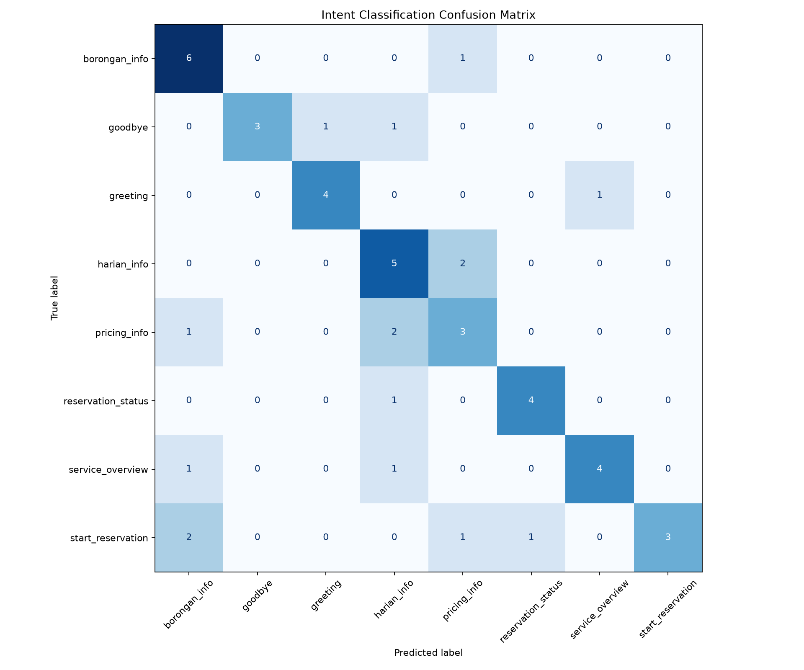

# Laporan Dataset dan Evaluasi NLP

Dokumen ini mencatat hasil aktual untuk `DOC-02`, `DOC-03`, dan `DOC-04`.
Seluruh angka berasal dari artifact yang dihasilkan oleh pipeline repository,
bukan dari perhitungan manual. Dataset yang dievaluasi memiliki SHA-256
`93641153746f7c85c17510ed00d224ae626aeafb1649bd0c29716df25feedb60`.

## 1. Konfigurasi eksperimen

- Model: TF-IDF dan Logistic Regression `tfidf-logreg-v1`.
- Split: stratified 80/20 dengan `random_state=42`, yaitu 192 data train dan
  48 data test.
- Pemilihan model: stratified 5-fold cross-validation hanya pada data train.
- Parameter terpilih: unigram, `min_df=1`, dan `C=0.5`.
- Best cross-validation macro F1: `0.704963`.
- Test set dipakai untuk evaluasi final, bukan untuk memilih model atau
  confidence threshold.

Sumber: [model metadata](../artifacts/models/intent-classifier.metadata.json)
dan [metrics](../artifacts/evaluation/metrics.json).

## 2. Hasil dataset dan preprocessing (`DOC-02`)

### 2.1 Distribusi intent

Dataset berisi tepat 240 utterance dalam 8 intent. Tidak ada kelas yang
mendominasi dataset; jumlah per kelas berada pada rentang 25–35 data.

| Intent | Jumlah | Persentase |
|---|---:|---:|
| `greeting` | 25 | 10.42% |
| `service_overview` | 30 | 12.50% |
| `borongan_info` | 35 | 14.58% |
| `harian_info` | 35 | 14.58% |
| `pricing_info` | 30 | 12.50% |
| `start_reservation` | 35 | 14.58% |
| `reservation_status` | 25 | 10.42% |
| `goodbye` | 25 | 10.42% |
| **Total** | **240** | **100.00%** |

Sumber data tabel:
[dataset-distribution.csv](../artifacts/evaluation/dataset-distribution.csv).
Stratifikasi mempertahankan proporsi tersebut pada train dan test, seperti
tercatat di
[split-distribution.csv](../artifacts/evaluation/split-distribution.csv).

### 2.2 Statistik panjang teks

Secara keseluruhan, utterance memiliki panjang 4–58 karakter dan 1–8 token.
Rata-ratanya adalah 33.94 karakter dan 5.13 token, sedangkan mediannya 36
karakter dan 5 token. Statistik per intent tersedia di
[text-length-summary.csv](../artifacts/evaluation/text-length-summary.csv).

### 2.3 Hasil preprocessing aktual

Pipeline melakukan normalisasi Unicode NFKC, lowercase, penggantian URL,
email, dan nomor telepon dengan token khusus, pembersihan HTML/karakter
kontrol, normalisasi whitespace dan tanda baca, lalu tokenisasi regex.
Stemming dan stopword removal tidak dipakai pada baseline.

| Sebelum | Setelah cleaning | Token |
|---|---|---|
| `Halo Kak!! Ada jasa tukang listrik?` | `halo kak ada jasa tukang listrik` | `["halo","kak","ada","jasa","tukang","listrik"]` |
| `Saya mau BOOKING tukang utk 02/08/2026.` | `saya mau booking tukang utk 02 08 2026` | `["saya","mau","booking","tukang","utk","02","08","2026"]` |
| `Cek tiket TKT-20260728-AB12CD dong` | `cek tiket tkt 20260728 ab12cd dong` | `["cek","tiket","tkt","20260728","ab12cd","dong"]` |
| `Hubungi 0812 3456 7890 atau CS@example.com` | `hubungi phonetoken atau emailtoken` | `["hubungi","phonetoken","atau","emailtoken"]` |
| `<b>Lihat info</b> di https://contoh.id/layanan` | `lihat info di urltoken` | `["lihat","info","di","urltoken"]` |

Tabel tersebut berasal langsung dari
[preprocessing-examples.csv](../artifacts/evaluation/preprocessing-examples.csv).
Fungsi preprocessing yang sama dibungkus di dalam pipeline model untuk
training dan inference sehingga tidak terjadi perbedaan transformasi.

## 3. Hasil evaluasi model (`DOC-03`)

### 3.1 Metrik keseluruhan

Evaluasi pada 48 data test menghasilkan 32 prediksi benar dan 16 prediksi
salah.

| Metrik | Precision | Recall | F1 | Support |
|---|---:|---:|---:|---:|
| Accuracy | `0.666667` | `0.666667` | `0.666667` | 48 |
| Macro average | `0.741071` | `0.670833` | `0.679116` | 48 |
| Weighted average | `0.730655` | `0.666667` | `0.669619` | 48 |

Accuracy dan macro F1 aktual berada di bawah baseline yang diinginkan, yaitu
`0.80`. Hasil ini tetap dilaporkan apa adanya dan menjadi dasar analisis error
pada bagian berikutnya.

### 3.2 Classification report

| Intent | Precision | Recall | F1 | Support |
|---|---:|---:|---:|---:|
| `borongan_info` | `0.600000` | `0.857143` | `0.705882` | 7 |
| `goodbye` | `1.000000` | `0.600000` | `0.750000` | 5 |
| `greeting` | `0.800000` | `0.800000` | `0.800000` | 5 |
| `harian_info` | `0.500000` | `0.714286` | `0.588235` | 7 |
| `pricing_info` | `0.428571` | `0.500000` | `0.461538` | 6 |
| `reservation_status` | `0.800000` | `0.800000` | `0.800000` | 5 |
| `service_overview` | `0.800000` | `0.666667` | `0.727273` | 6 |
| `start_reservation` | `1.000000` | `0.428571` | `0.600000` | 7 |

`pricing_info` memiliki F1 terendah (`0.461538`), sedangkan
`start_reservation` memiliki recall terendah (`0.428571`). Detail yang dapat
diproses mesin tersedia di
[classification-report.csv](../artifacts/evaluation/classification-report.csv).

### 3.3 Confusion matrix

Baris menunjukkan intent aktual dan kolom menunjukkan intent prediksi.

| Aktual \ Prediksi | `borongan_info` | `goodbye` | `greeting` | `harian_info` | `pricing_info` | `reservation_status` | `service_overview` | `start_reservation` |
|---|---:|---:|---:|---:|---:|---:|---:|---:|
| `borongan_info` | **6** | 0 | 0 | 0 | 1 | 0 | 0 | 0 |
| `goodbye` | 0 | **3** | 1 | 1 | 0 | 0 | 0 | 0 |
| `greeting` | 0 | 0 | **4** | 0 | 0 | 0 | 1 | 0 |
| `harian_info` | 0 | 0 | 0 | **5** | 2 | 0 | 0 | 0 |
| `pricing_info` | 1 | 0 | 0 | 2 | **3** | 0 | 0 | 0 |
| `reservation_status` | 0 | 0 | 0 | 1 | 0 | **4** | 0 | 0 |
| `service_overview` | 1 | 0 | 0 | 1 | 0 | 0 | **4** | 0 |
| `start_reservation` | 2 | 0 | 0 | 0 | 1 | 1 | 0 | **3** |

Sumber:
[confusion-matrix.csv](../artifacts/evaluation/confusion-matrix.csv) dan
[confusion-matrix.png](../artifacts/evaluation/confusion-matrix.png).

### 3.4 Confidence fallback

Runtime memakai threshold `0.17` yang dipilih dari prediksi out-of-fold pada
data train, bukan dari test set. Pada test set, 11 dari 48 prediksi (`0.229167`)
berada di bawah threshold dan akan diarahkan ke fallback. Accuracy dan
confusion matrix di atas tetap menghitung kelas dengan probabilitas tertinggi
sebelum fallback agar kualitas classifier dapat dibandingkan secara langsung.

## 4. Analisis intent yang paling sering salah (`DOC-04`)

### 4.1 Pasangan error terbesar

Jika dua arah digabung, pasangan `harian_info` ↔ `pricing_info` merupakan
pasangan yang paling sering tertukar: 4 dari total 16 error (`25%`). Rinciannya
adalah 2 data `harian_info` diprediksi sebagai `pricing_info` dan 2 data
`pricing_info` diprediksi sebagai `harian_info`.

Pada hitungan berarah, nilai off-diagonal terbesar adalah 2 dan terjadi pada
tiga arah: `harian_info` → `pricing_info`, `pricing_info` → `harian_info`, dan
`start_reservation` → `borongan_info`. Pembedaan ini penting agar istilah
“pasangan” tidak menyembunyikan hasil seri pada confusion matrix.

### 4.2 Evidence utterance `harian_info` ↔ `pricing_info`

| ID | Teks | Aktual | Prediksi | Confidence |
|---|---|---|---|---:|
| `utt-0098` | Kalian menyediakan spesialis keramik? | `harian_info` | `pricing_info` | `0.163821` |
| `utt-0113` | Saya ingin tahu cakupan kerja spesialis pipa | `harian_info` | `pricing_info` | `0.150758` |
| `utt-0152` | Kalau pilih setengah hari apakah lebih murah? | `pricing_info` | `harian_info` | `0.154826` |
| `utt-0132` | Kalau pesan beberapa hari hitungannya bagaimana? | `pricing_info` | `harian_info` | `0.154630` |

Data `pricing_info` yang salah sama-sama memakai konteks durasi layanan
Harian—“setengah hari” dan “beberapa hari”—sehingga sinyal jenis layanan
bersaing dengan tujuan menanyakan harga. Sebaliknya, dua pertanyaan cakupan
spesialisasi tidak mengandung kata harga eksplisit tetapi tetap diprediksi
sebagai `pricing_info`. Dengan dataset kecil dan representasi unigram
terpilih, hasil ini menunjukkan bahwa model belum memiliki pemisah leksikal
yang stabil antara cakupan Tukang Harian dan perhitungan harganya.

Keempat confidence berada di bawah threshold `0.17`. Karena itu, runtime akan
memberikan fallback terarah untuk keempat contoh, bukan langsung menampilkan
jawaban dari intent yang salah. Fallback mengurangi dampak kesalahan, tetapi
tidak mengubah hasil evaluasi mentah classifier.

### 4.3 Error penting lain

`start_reservation` salah menjadi `borongan_info` pada dua data:

- `utt-0187`: “Saya hendak mengajukan pekerjaan borongan” (`0.213965`).
- `utt-0160`: “Mulai pengajuan borongan untuk rumah saya” (`0.220855`).

Keduanya memuat kata `borongan`, tetapi tujuan utamanya adalah tindakan
memulai reservasi. Confidence keduanya melewati threshold sehingga error ini
tidak tertahan oleh fallback. Evidence ini sejalan dengan recall
`start_reservation` yang hanya `0.428571` dan menunjukkan bahwa kata jenis
layanan dapat mengalahkan frasa tindakan seperti “hendak mengajukan” atau
“mulai pengajuan”.

Perbaikan yang perlu diuji pada eksperimen berikutnya adalah menambah variasi
dan hard negative yang memasangkan kata jenis layanan dengan tujuan berbeda,
khususnya cakupan versus harga serta informasi versus aksi reservasi. Dampaknya
harus dibuktikan dengan split evaluasi baru atau cross-validation; laporan ini
tidak mengklaim bahwa usulan tersebut sudah meningkatkan metrik.

Seluruh 16 contoh error tersedia di
[misclassified.csv](../artifacts/evaluation/misclassified.csv).
