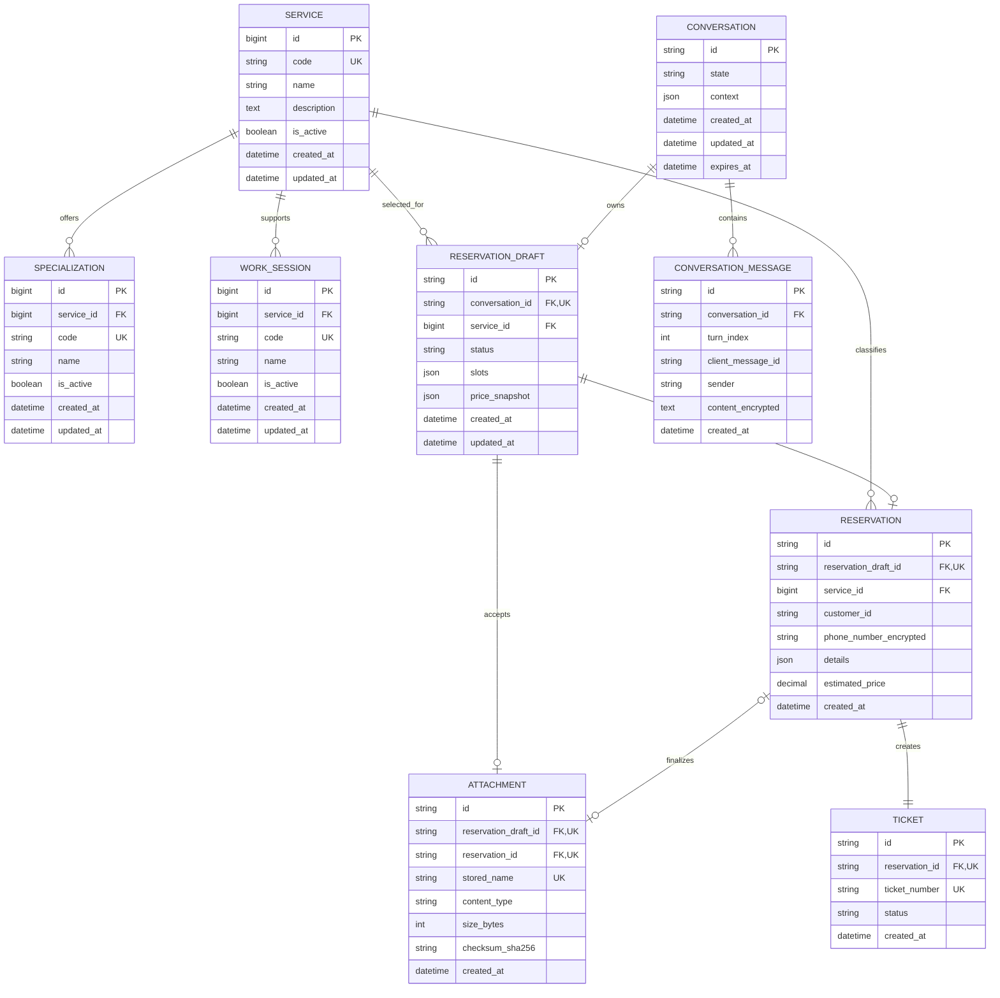

# Entity Relationship Diagram

ERD ini adalah sumber utama rancangan persistence MySQL Reservation Chatbot.
Detail unik Jasa Borongan dan Tukang Harian tetap disimpan sebagai JSON yang
divalidasi Pydantic agar scope MVP tidak berkembang menjadi terlalu banyak
table. Katalog yang membutuhkan referensi stabil tetap dinormalisasi.

## Diagram



## Kardinalitas

| Relasi | Aturan MVP |
|---|---|
| Service–Specialization | Satu service memiliki nol atau banyak specialization; enam specialization hanya dimiliki Tukang Harian |
| Service–Work Session | Sesi `full_day`, `morning`, dan `afternoon` berlaku untuk Tukang Harian |
| Conversation–Message | Satu conversation memiliki banyak message berurutan |
| Conversation–Draft | Maksimal satu reservation draft aktif/terminal per conversation |
| Draft–Attachment | Maksimal satu foto opsional dan hanya untuk draft Tukang Harian |
| Draft–Reservation | Draft hanya menjadi satu reservation setelah pengguna mengonfirmasi |
| Reservation–Ticket | Setiap reservation final wajib memiliki tepat satu ticket |
| Reservation–Attachment | Attachment draft ditautkan ke reservation saat transaksi konfirmasi selesai |

## Data dictionary

### Catalog

#### `service`

| Kolom | Aturan |
|---|---|
| `code` | Unique immutable slug: `borongan` atau `harian` |
| `name` | Nama tampilan: Jasa Borongan atau Tukang Harian |
| `is_active` | Item nonaktif tidak ditawarkan untuk draft baru |

#### `specialization`

| Kolom | Aturan |
|---|---|
| `service_id` | FK ke service `harian` |
| `code` | Unique canonical value: `cat`, `genteng`, `ac`, `listrik`, `keramik`, atau `pipa` |
| `name` | Spesialis Cat, Genteng, AC, Listrik, Keramik, atau Pipa |
| `is_active` | Nilai historis tetap dapat dibaca walau tidak lagi ditawarkan |

#### `work_session`

| Kolom | Aturan |
|---|---|
| `service_id` | FK ke service `harian` |
| `code` | `full_day`, `morning`, atau `afternoon` |
Tarif tidak dihitung dengan multiplier bebas. Backend memakai lookup matrix
fixed `daily_rate[specialization][work_session]` dari `pricing-v1`. Harga
Borongan memakai lookup fixed `borongan_base[building_type]`. Nominal lengkap
berada pada [MVP plan](../01-mvp-plan.md#34-harga-demo-tetap) dan disalin ke
snapshot transaksi agar perubahan version berikutnya tidak mengubah reservasi
lama.

### Conversation

#### `conversation`

| Kolom | Aturan |
|---|---|
| `id` | ULID 26 karakter |
| `state` | Salah satu `ConversationState` pada kontrak OpenAPI |
| `context` | Metadata dialog non-transaksional, bukan salinan reservation final |
| `expires_at` | Setelah waktu ini API mengembalikan `CONVERSATION_EXPIRED` |

#### `conversation_message`

| Kolom | Aturan |
|---|---|
| `conversation_id` | FK dengan index untuk restore history |
| `turn_index` | Urutan monotonik di dalam conversation |
| `client_message_id` | Diisi untuk user message; unique bersama `conversation_id` sebagai idempotency key |
| `sender` | `user` atau `bot` |
| `content_encrypted` | Teks terenkripsi karena user message dapat mengandung nomor telepon/alamat |

Unique constraint yang dibutuhkan:

```text
UNIQUE (conversation_id, turn_index)
UNIQUE (conversation_id, client_message_id)
```

`client_message_id` boleh null untuk bot message. Implementasi unique
constraint harus mengikuti perilaku null MySQL.

### Reservation

#### `reservation_draft`

| Kolom | Aturan |
|---|---|
| `conversation_id` | Unique FK; satu conversation maksimal satu draft |
| `service_id` | Service yang dipilih pengguna |
| `status` | `ACTIVE`, `CONFIRMED`, atau `CANCELLED` |
| `slots` | Nilai parsial tervalidasi; input invalid tidak menimpa JSON ini |
| `price_snapshot` | Breakdown dan `pricing_version` untuk Harian maupun Borongan |

Contoh `slots` Borongan:

```json
{
  "customer_id": "0123456789",
  "phone_number_encrypted": "<ciphertext>",
  "building_type": "rumah",
  "survey_address": "Alamat survei tervalidasi",
  "survey_date": "2026-08-03",
  "survey_time": "09:00",
  "budget": 20000000,
  "pricing_version": "pricing-v1",
  "estimated_price": 5125000
}
```

Contoh `slots` Tukang Harian:

```json
{
  "customer_id": "0123456789",
  "phone_number_encrypted": "<ciphertext>",
  "specialization": "listrik",
  "problem_description": "Instalasi listrik sering turun.",
  "worker_count": 2,
  "start_date": "2026-08-03",
  "end_date": "2026-08-04",
  "work_session": "full_day",
  "work_address": "Alamat pekerjaan tervalidasi",
  "attachment_id": "01K1A2B3C4D5E6F7G8H9J0K1M4",
  "pricing_version": "pricing-v1",
  "estimated_price": 1325000
}
```

#### `reservation`

| Kolom | Aturan |
|---|---|
| `reservation_draft_id` | Unique FK untuk mencegah finalisasi draft dua kali |
| `customer_id` | `CHAR(10)` berisi tepat 10 digit; tidak memiliki relasi master customer pada MVP |
| `phone_number_encrypted` | Nomor canonical `+62` yang dienkripsi |
| `details` | Snapshot immutable detail layanan saat confirmation |
| `estimated_price` | Total fixed `pricing-v1`; wajib terisi untuk Harian dan Borongan |

`details` menyimpan field unik layanan selain customer ID dan telepon.
Borongan menyimpan `building_type`, alamat/jadwal survei, `budget`, serta
breakdown harga dasar/survei/admin. Harian menyimpan specialization, deskripsi,
jumlah pekerja, rentang tanggal, sesi, alamat kerja, dan breakdown harga.

#### `ticket`

| Kolom | Aturan |
|---|---|
| `reservation_id` | Unique FK; satu reservation tepat satu ticket |
| `ticket_number` | Unique: literal `TKT`, tanggal 8 digit, dan 6 huruf kapital/angka; contoh `TKT-20260728-AB12CD` |
| `status` | `MENUNGGU_PEMBAYARAN` setelah confirmation |

Pembuatan `reservation`, pengaitan attachment, perubahan draft menjadi
`CONFIRMED`, dan pembuatan `ticket` harus berada dalam satu database
transaction.

### Attachment

| Kolom | Aturan |
|---|---|
| `reservation_draft_id` | Unique FK; satu draft maksimal satu foto |
| `reservation_id` | Nullable sebelum confirmation, lalu diisi saat finalisasi |
| `stored_name` | Generated filename; tidak berasal dari nama upload pengguna |
| `content_type` | `image/jpeg`, `image/png`, atau `image/webp` |
| `size_bytes` | Harus di bawah batas `MAX_UPLOAD_MB` |
| `checksum_sha256` | Integritas binary dan bantuan deteksi duplikat |

Binary file berada pada `storage/uploads`, bukan sebagai BLOB MySQL.
Penghapusan draft yang dibatalkan harus memiliki cleanup policy agar metadata
dan file tidak menjadi orphan.

## Constraint dan index minimum

- Semua foreign key memiliki index.
- `service.code`, `specialization.code`, `ticket.ticket_number`, dan
  `attachment.stored_name` unique.
- `reservation_draft.conversation_id`,
  `reservation.reservation_draft_id`, dan `ticket.reservation_id` unique.
- Check constraint atau application validation membatasi status, sender,
  service type, specialization, dan work session ke nilai canonical.
- `customer_id` wajib cocok dengan regex `^[0-9]{10}$` dan disimpan sebagai
  string agar leading zero tidak hilang.
- `ticket_number` wajib cocok dengan regex
  `^TKT-[0-9]{8}-[A-Z0-9]{6}$`.
- Nilai uang menggunakan `DECIMAL`/integer rupiah, bukan floating point.
- Timestamp disimpan dalam UTC dan dikonversi ke `Asia/Jakarta` pada boundary
  API.
- Delete conversation/reservation tidak dilakukan otomatis pada MVP. Retention
  dijalankan eksplisit agar ticket tidak hilang akibat cascade yang tidak
  disengaja.

Index akses utama:

```text
conversation(expires_at)
conversation_message(conversation_id, turn_index)
reservation_draft(conversation_id)
ticket(ticket_number)
attachment(reservation_draft_id)
```

## Data yang tidak dimodelkan sebagai table

- Binary model NLP berada di `artifacts/models`.
- Conversation audit log append-only berada di `data/logs/*.jsonl`; log ini
  berbeda dari `conversation_message` yang dipakai untuk restore UI.
- Binary foto berada di local file storage.
- Slot survei demo dihasilkan dari konfigurasi hari/jam kerja. Table
  availability baru dibutuhkan bila integrasi jadwal real-time masuk scope.
- Payment, customer account, worker assignment, dan email delivery berada di
  luar scope MVP.
