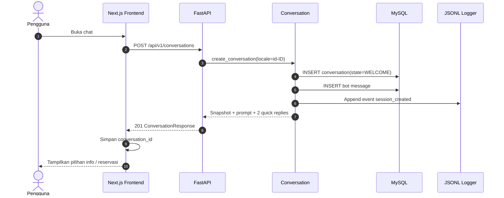
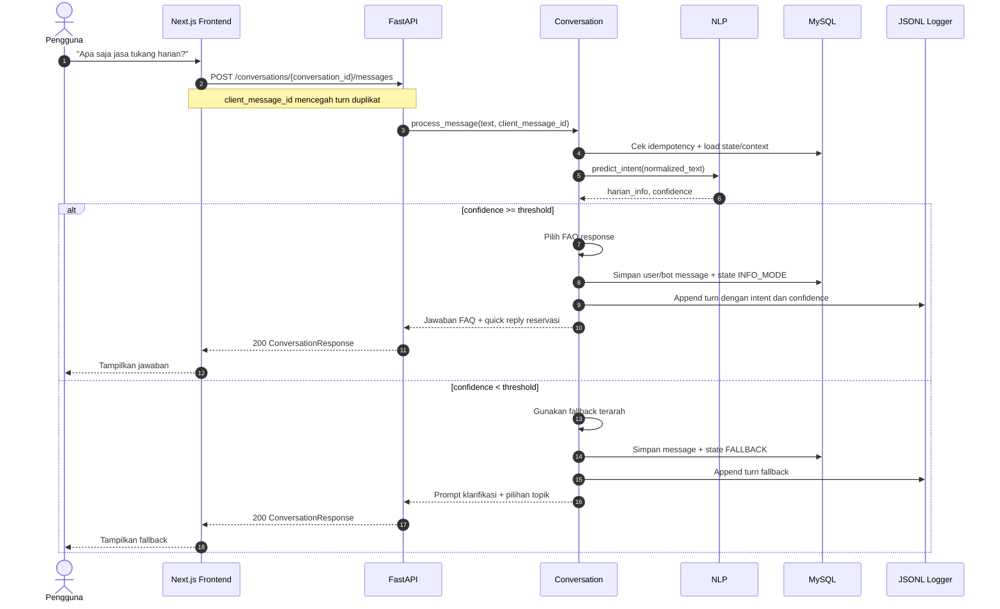
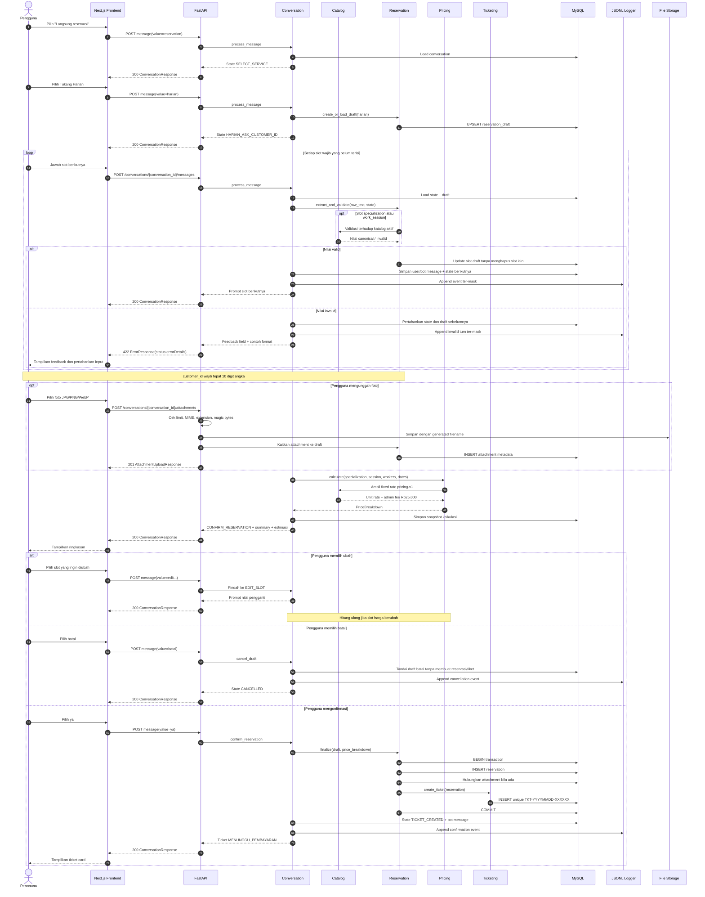
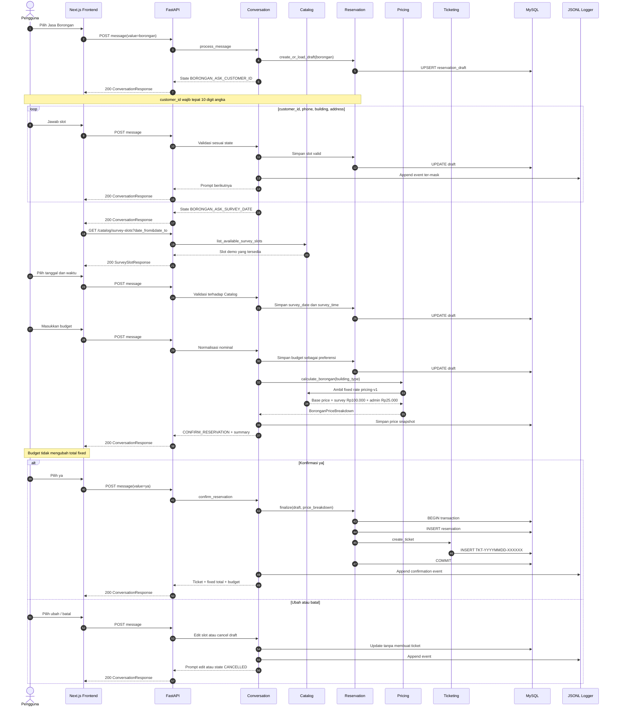
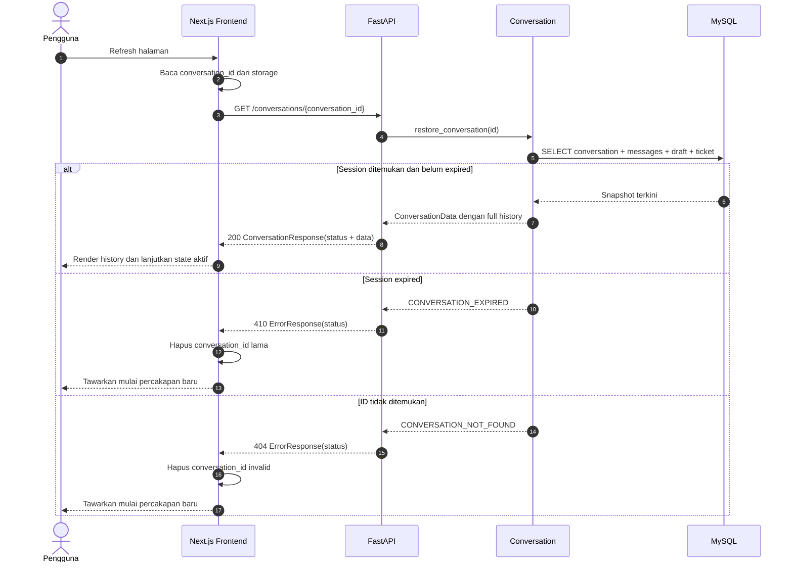
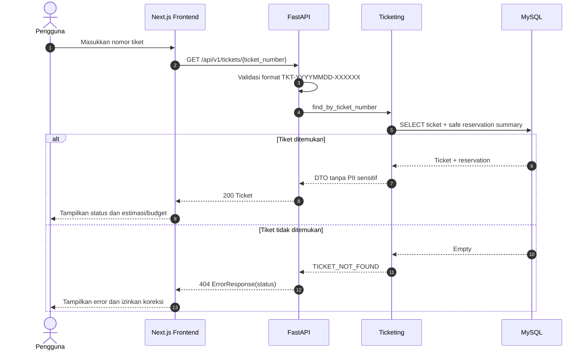

# Sequence Diagram

Dokumen ini menjelaskan interaksi runtime utama Reservation Chatbot. Kontrak
request/response normatif berada di
[OpenAPI contract](../api-contract/openapi.yml), sedangkan state dan aturan
slot dijelaskan di [NLP and dialog design](../03-nlp-and-dialog-design.md).

## Komponen

| Nama | Tanggung jawab |
|---|---|
| Pengguna | Memilih jalur, memberikan slot, dan mengonfirmasi reservasi |
| Frontend | Menampilkan chat dan menyimpan `conversation_id`; tidak menentukan state atau harga |
| API | Validasi HTTP, rate limit, envelope `status`/`data`, dan routing |
| Conversation | State machine, slot priority, prompt, serta global command |
| NLP | Preprocessing dan prediksi intent pada info mode |
| Catalog | Layanan, spesialisasi, sesi kerja, tarif, dan slot survei |
| Reservation | Draft, validasi lintas field, finalisasi reservasi |
| Pricing | Kalkulasi fixed `pricing-v1` untuk Harian dan Borongan |
| Ticketing | Pembuatan nomor tiket unik dan lookup |
| MySQL | State, message, draft, reservasi, attachment metadata, dan tiket |
| JSONL Logger | Satu event ter-mask untuk setiap turn |
| File Storage | Binary foto dengan generated filename |

Path tanpa prefix pada diagram panjang adalah singkatan dari `/api/v1`.

## 1. Membuka chat dan membuat conversation

Frontend membuat conversation baru hanya bila belum memiliki
`conversation_id` yang valid. Refresh halaman menggunakan alur restore pada
bagian 5.

## 2. Jalur tanya layanan dan fallback NLP

Perintah global `batal`, `menu`, `bantuan`, dan `mulai ulang` diperiksa oleh
Conversation sebelum memanggil model NLP.

## 3. Reservasi Tukang Harian

Enam nilai specialization canonical adalah `cat`, `genteng`, `ac`, `listrik`,
`keramik`, dan `pipa`. Hanya cabang konfirmasi yang boleh membuat reservation
dan ticket.

## 4. Reservasi Jasa Borongan

## 5. Refresh dan pemulihan conversation

## 6. Lookup tiket

## 7. Aturan kegagalan dan retry

- HTTP `422` berarti bentuk request atau nilai slot tidak valid. Feedback field
  berada pada `status.errorDetails`; frontend mempertahankan input dan meminta
  pengguna memperbaikinya.
- Invalid slot tetap dicatat sebagai turn dan tidak menghapus state/slot valid
  sebelumnya, walaupun response menggunakan error envelope HTTP `422`.
- HTTP `409` berarti operasi tidak sesuai state aktif, misalnya upload foto
  pada draft Borongan.
- HTTP `410` membuat frontend membuang session lokal yang kedaluwarsa.
- HTTP `429` mengikuti header `Retry-After`; HTTP `503` boleh di-retry dengan
  backoff. Retry message memakai `client_message_id` yang sama.
- Kegagalan sebelum database `COMMIT` me-rollback reservasi dan tiket bersama.
  Sistem tidak boleh menghasilkan tiket tanpa reservation atau menghasilkan
  dua tiket akibat retry.
